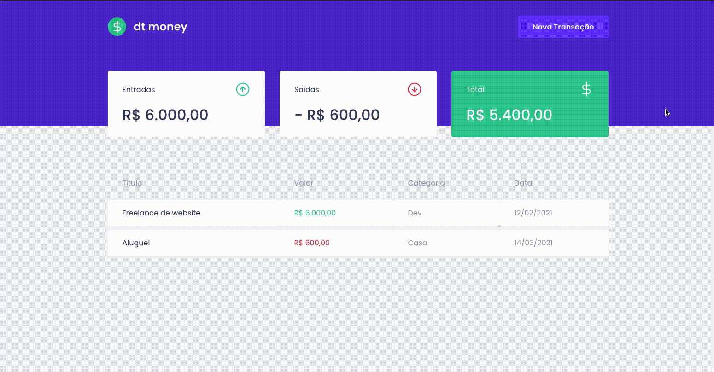

  

An ReactJS application for finances management

   

## 🚀 Technologies

This project was developed with the following technologies:

- [ReactJS](https://reactjs.org/)
- [TypeScript](https://www.typescriptlang.org/)
- [React Modal](https://github.com/reactjs/react-modal)
- [MirageJS](https://miragejs.com/)
- [Styled Components](https://styled-components.com/)
- [Polished](https://github.com/styled-components/polished)
- [Axios](https://github.com/axios/axios)

## 💻  Getting started

1. Clone this repo using `https://github.com/gustavonobrega/ignite-dtmoney`
2. Move to the appropriate directory: `cd dtmoney`. 
3. Run `yarn` to install dependencies. 
4. Run `yarn start` to see the example app at `http://localhost:3000`.

---

Made with ♥ by Gustavo Nobrega